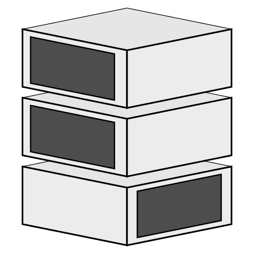

[github]: https://github.com/threadexio/sfsdb
[ghreleases]: https://github.com/threadexio/sfsdb/releases
[ghtests]: https://github.com/threadexio/sfsdb/actions/workflows/tests.yml
[ghdockerbuild]: https://github.com/threadexio/sfsdb/actions/workflows/build-docker.yml
[dockerhub]: https://hub.docker.com/repository/docker/thatrandomguy/sfsdb

<div align="center">



</div>

# sfsdb

[][ghtests]
[][ghdockerbuild]

[][ghreleases]
[][dockerhub]

[][github]
[][dockerhub]

`S`imple
`F`ile
`S`torage
`D`ata`B`ase

A simple but powerful application to store large and small files.

# What's this?

`sfsdb` is a service that offers the ability to store and retrieve files via a set of commands. It was originally intended for use in webapps to provide a fast and dedicated space for storing files instead of putting them in the database. This option is more beneficial to the developer as it allows for greater flexibility and is only limited by the filesystem it is running under. For example, if your instance is running under `btrfs` you can snapshot all of the stored files with only one command, and theoretically even while the software is running. This flexibility allows the server to be shutdown and spun back up again extremely quickly with very little, if not zero, data loss.

# How does it work?

It uses volumes, which are basically any directory that files can be stored on. These volumes keep a track of the files uploaded by giving them unique time-based identifiers. Because volumes are just directories, it is possible to change the mount at that directory to alter the purpose of the software. For example, you could mount a `tmpfs` filesystem, with sufficient size, on the volume and have the server act as a file cache instead of long-term storage.

# Usage

All configuration can be done via command line parameters.

A docker image is also available [here](https://hub.docker.com/r/thatrandomguy/sfsdb) built from the latest release.

# Building

As simple as:

```
$ make
```

The resulting server and command line client binaries can be found over at `build/src/`

# Usage

Just run the binary with `--help` and it will explain everything you need to know. An example empty volume can be found in the `example/` directory.

## Hooks

Hooks reside in the root of each volume in a subdirectory called `hooks` and are executed with alphabetic wildcard order, to see the order of execution before running the server use `ls | sort` on the appropriate hook directory. A hook is any executable file, whether that would be an ELF file or a shell script or some other executable format is up to the user. Hooks can be used for example to mount the correct filesystem on startup or shutdown of the server or perform any other cleanup that might be required.

A hook can either run on startup if placed in `hooks/pre.d/` or on shutdown if placed in `hooks/post.d/`.

If a hook exits with the magic value `164` the server will not execute the rest of the hooks and immediately exit.
